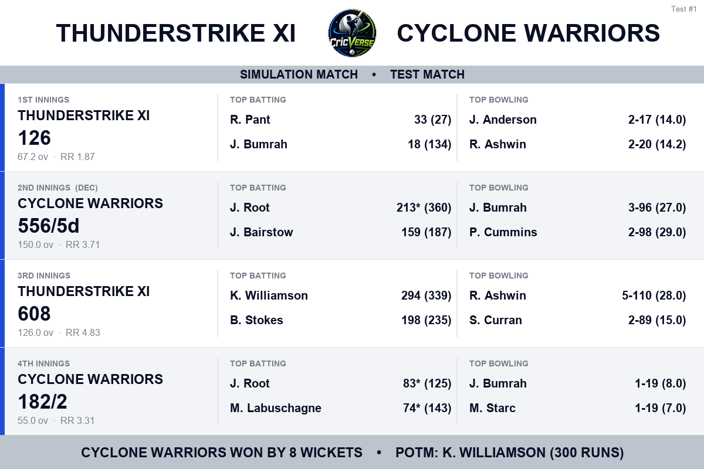

<h1 align="center">CricVerse</h1>

<p align="center">
  <b>A full-featured cricket simulation bot for Discord</b><br>
  Ball-by-ball match engine · multi-format tournaments · draft mode · player careers
</p>

<p align="center">
  
  
  
  
</p>

<p align="center">
  
  <br><i>An actual match summary rendered by the bot (5-day Test, fully simulated)</i>
</p>

## What it is

CricVerse simulates cricket at the per-ball level - every delivery is a contest
between a batter and a bowler, shaped by pitch, weather, ball age, match
situation, and player ratings. It runs T20, ODI, and Test matches (including
day-night pink-ball Tests), full tournaments, a knowledge-based draft mode, and
a persistent player-career layer - all inside Discord, with broadcast-style
scorecards rendered as images.

Everything is playable both interactively (pick your delivery and shot each
ball) or instantly simulated.

## Features

**Match engine**
- Three formats: T20, ODI, and 5-day Tests with sessions, declarations,
  follow-ons, and new/old ball dynamics.
- Day-night pink-ball Tests: the ball swings under lights and the twilight
  session is a genuine danger period for pace.
- Conditions matter: 15 pitch types, ~10 weather states, pitch deterioration,
  ball-age swing and reverse, Super Overs for ties.
- Calibrated, not random: outcome weights are Monte-Carlo tuned so skill
  decides matches - no freak 250s or 30-all-out collapses between equal sides.

**Tournaments & leagues**
- Round robin, T20 World Cup (groups > Super 8 > knockouts), IPL-style
  seasons, and a bespoke 14-team Akatsuki Cricket League with Top-6 playoffs.
- The Dominators Super League: a recurring home/away ODI league with fixed
  home venues, season archives, player awards, and multi-season history.
- An open Elo-style rating ladder with trades and a boost economy.
- Auto-generated fixtures, live points tables with NRR, knockout brackets,
  per-player tournament leaderboards, and image-rendered standings.

**Draft mode**
- A blind, knowledge-based draft: ratings are hidden, each round asks a
  question ("name a leg-spinner", "name a finisher keeper") and captains build
  a balanced XI from memory before the match is played out. 1v1 or vs AI.

**Career mode**
- Create a player, earn coins from solo scenarios and club matches, upgrade
  attributes, climb tiers (Bronze through Diamond) with matching Discord roles.

**Player system**
- 1,200+ players with batting/bowling ratings, roles, and playing-style
  archetypes, plus per-server rating overrides.

## Tech stack

Python 3.11+, [discord.py](https://github.com/Rapptz/discord.py) 2.x (slash +
prefix commands), MongoDB via pymongo for persistence, Pillow for image
rendering, and a small Flask server for uptime pings.

## Getting started

```bash
git clone https://github.com/TheJaiv/CricVerse.git
cd CricVerse
pip install -r requirements.txt
cp .env.example .env    # fill in DISCORD_TOKEN and MONGO_URI
python bot.py
```

New to Discord bots or MongoDB? **[SETUP.md](SETUP.md) walks through the whole
thing step by step** - creating the Discord application, a free MongoDB Atlas
cluster, inviting the bot, loading the player database, and hosting.

## Commands

Commands work as both slash (`/command`) and the `cv` prefix (`cvt` =
tournament, `cvd` = draft).

| Command | What it does |
|---------|--------------|
| `cv match [@opponent]` | Interactive match vs a user or the AI |
| `cv simulatematch` | Instantly simulate a full match |
| `cvd [@opponent]` | Blind draft, then the drafted XIs play it out |
| `cvt create` / `cvt start` | Create and launch a tournament |
| `cvt fixtures` / `cvt standings` / `cvt bracket` | Track a running tournament |
| `cv career` | Create and manage your career player |
| `cv searchplayer <name>` | Look up a player's ratings |

## Project layout

```
bot.py         Discord client, commands, interactive flows, image rendering
engine/        Ball-by-ball simulation: t20, odi, test + test scorecard images
league/        Tournaments, DSL league, rating ladder, stadiums, draft mode
career/        Career mode: progression, club matches, UI views
core/          MongoDB persistence, tiers/quotas, keep-alive server
data/          Player database (CSV), ratings dump, curated draft pool
assets/        Image templates and fonts for rendered scorecards
tools/         Calibration harnesses and offline test suites
archive/       Superseded engine versions kept for A/B comparison
```

## Testing & calibration

The engines are tuned against Monte-Carlo harnesses in `tools/` rather than
eyeballed: `sim_harness.py` checks first-innings par scores, upset rates at
various rating gaps, and wicket distributions across formats and conditions.

Offline flow tests exercise the real bot code headlessly - no Discord or
database connection needed:

```bash
python3 tools/career_flow_test.py    # 170 checks
python3 tools/ipl_flow_test.py       # 79 checks incl. 300 fuzzed seasons
python3 tools/dsl_flow_test.py       # 34 checks
python3 tools/rating_league_test.py  # 21 checks
```

## License

[MIT](LICENSE) © Jaiv Patel
